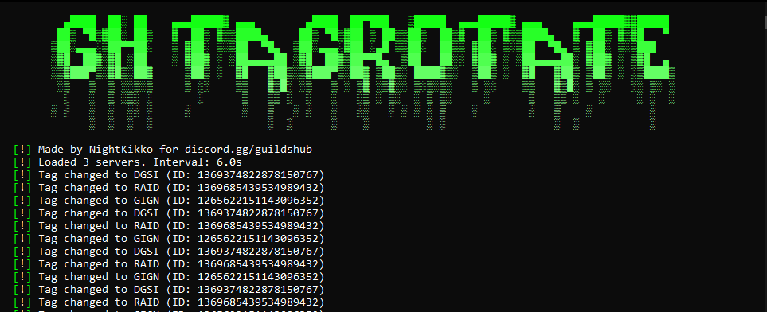

## 🚀 GH-TagRotator
A Python script to rotate your Discord clan tag across multiple servers using the Discord API, created by **NightKikko**! 🌟

### 📋 Prerequisites
- `🐍` Python 3.x installed
- `🌐` Internet connection
- `🎮` Discord account with a valid user token

### 🚀 Installation
- `📥` **Clone the repository** or download the files manually.
- `🔧` **Set up the project**:
   - Double-click `setup.bat` (Windows) to automatically download and install dependencies from `requirements.txt`
   - If `config.ini` doesn’t exist, the script will create one and prompt you for:
     - `🎫` **Discord User Token**: Get this by following the steps below.
     - `⏱️` **Rotation Interval**: Time (in seconds) between tag changes.
     - `🆔` **Server IDs**: Comma-separated list of guild IDs to rotate through.
   - Edit `config.ini` manually if needed.
3. `🖥️` **Run the script**:
   - Double-click `run.bat` (Windows) to launch `main.py`.
   - Alternatively, run `python main.py` in your terminal.

### 🔑 How to Get Your Discord User Token
⚠️ **Note**: This script requires your Discord **user token**, we DON'T COLLECT IT, only saving it for speed on run. Follow these steps carefully to retrieve it:
1. `🖥️` Open Discord in your browser (e.g., Chrome, Firefox).
2. `🔍` Press `Ctrl+Shift+I` (or `Cmd+Option+I` on Mac) to open the Developer Tools.
3. `📡` Go to the **Network** tab in Developer Tools.
4. `📨` In Discord, send a message or perform any action to trigger API requests.
5. `🔎` In the Network tab, filter by `api` and look for a request (e.g., `messages` or `guilds`).
6. `👀` Click on the request, go to the **Headers** section, and scroll down to find the `Authorization` header.
7. `🔐` Copy the value next to `Authorization`—this is your user token (it looks like a long string, e.g., `mfa.XXXXX` or `XXXXX.XXXXX.XXXXX`).
8. `📋` Paste it when prompted by the script or add it to `config.ini`.

⚠️ **Important**: Never share your user token with anyone, as it grants full access to your Discord account. If you accidentally expose it, reset it immediately by changing your password.

### 📂 Project Structure
- `config.ini` 🛠️ - Configuration file for token, interval, and guild IDs.
- `main.py` 💻 - Main script logic.
- `requirements.txt` 📋 - List of dependencies.
- `run.bat` 🕹️ - Windows batch file to launch the script.
- `setup.bat` 🔧 - Windows batch file for initial setup and dependency installation.
- `image.png` 🖼️ - Image showing the tool in action (already placed above).

### 🎮 Usage
- Run the script, and it will cycle through the specified server IDs, updating your clan tag.
- Press `Ctrl+C` to stop the script gracefully. 🚪

### ⚠️ Warnings
- 🚫 Never share your Discord user token.
- 🔒 Use this responsibly and comply with Discord’s Terms of Service. Using user tokens for automation may violate Discord's policies, so proceed at your own risk.

# ❤️ **Made by NightKikko for discord.gg/guildshub** ❤️
